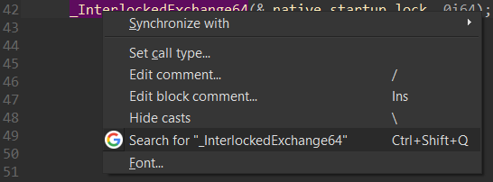

# Search from IDA

Highlight a string in IDA and look it up using your search engine of choice.

The idea is taken from a [plugin](https://github.com/intezer/scripts) by Intezer Labs, which I've decided to rewrite from scratch.

## FAQ

### How to install?

Simply put `search_from_ida.py` and the `icons` directory in the user plugins directory:

| OS | User plugins directory |
| --- | --- |
| Windows | `%APPDATA%\Hex-Rays\IDA Pro\plugins` |
| Linux/Mac | `~/.idapro/plugins` |

Both Python 2 and 3 are supported.

### How to change the search engine?

In the plugin's source code, change the value of `QUERY_URL_FORMAT`.  
Optionally, add an icon to the `icons` directory.
